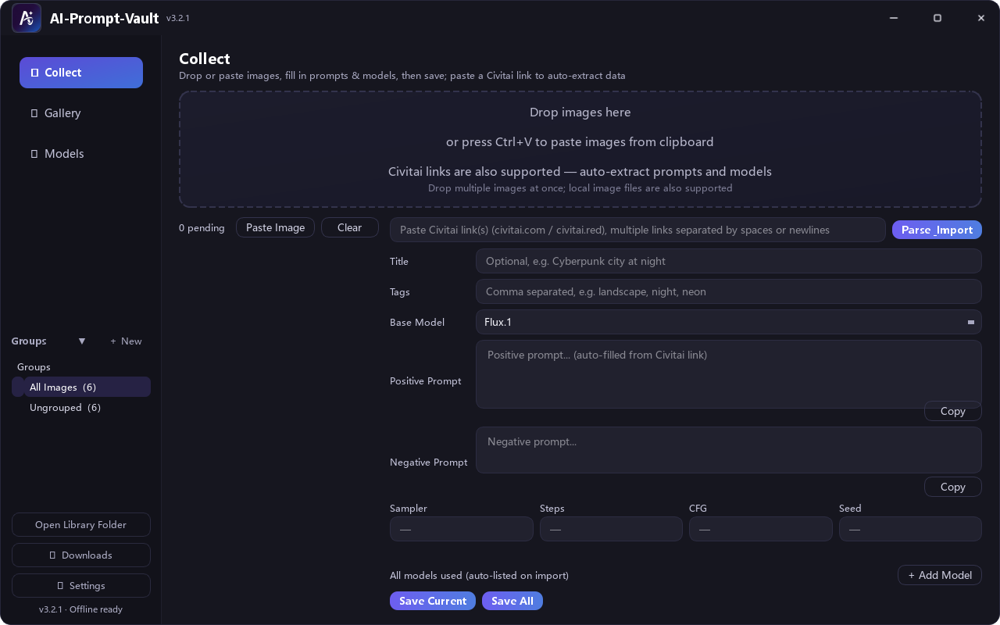
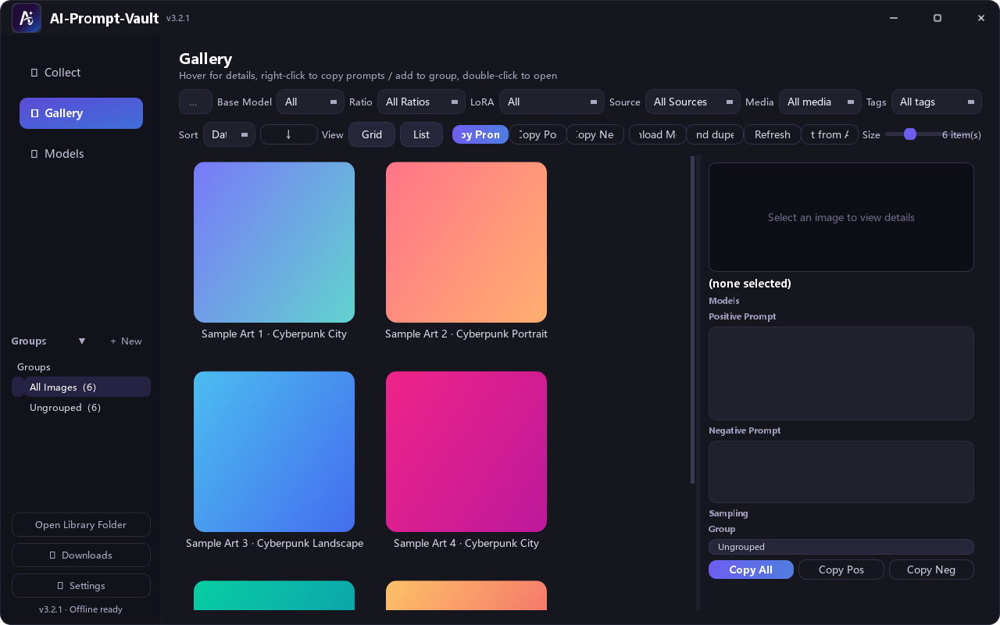
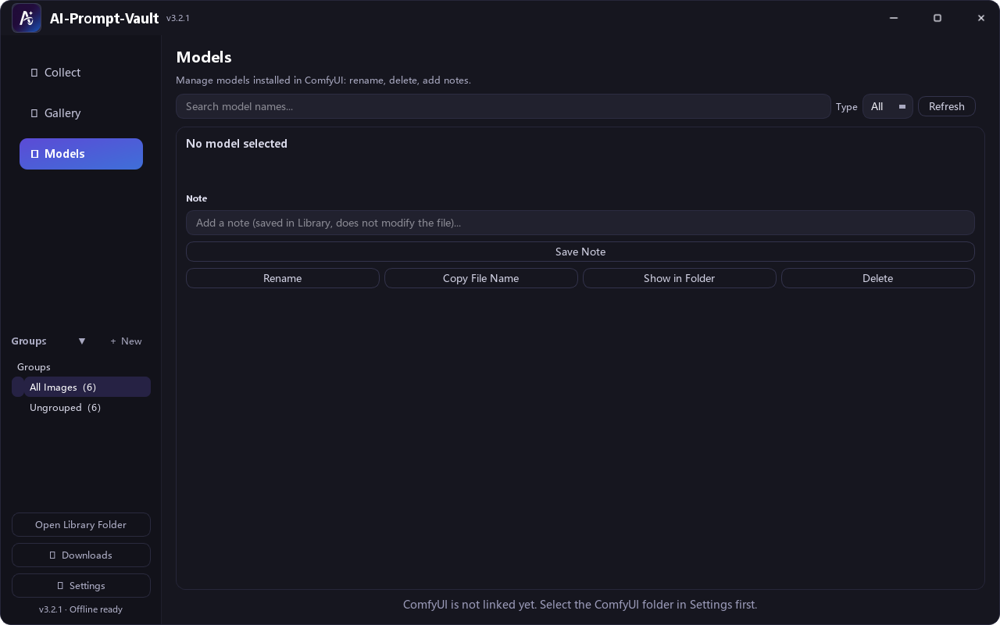

# AI 绘图资料整理（AI Prompt Vault）

> A fully offline Windows tool to organize your AI-generated art — reference images, prompts & models in one place.
> 一款**完全离线**、独立界面的 Windows 本地小工具，用于收集整理 AI 绘画作品（例图 + 提示词 + 模型参数）。
>
> 支持四语界面 · 4 languages: **中文 / English / Español / 日本語**

---

## ✨ 核心功能 / Features

| 中文 | English |
| --- | --- |
| **收藏作品**：把网页上的例图直接拖进来、Ctrl+V 粘贴，或粘贴 Civitai 图片·模型·视频分享链接一键导入——自动提取提示词、模型清单、采样参数，并下载原图 / 视频 | **Collect**：drag & drop web images, paste with Ctrl+V, or paste a Civitai image·model·video link for one-click import — prompts, model lists and sampling params are extracted automatically, originals downloaded |
| **图库浏览**：平铺 / 列表双模式，支持排序、多条件筛选与关键词搜索；列表悬停显示大图预览；导入的视频正确显示分辨率 | **Gallery**：grid / list views with sorting, multi-filter and keyword search; large hover preview in List view; imported videos show their real resolution |
| **我的作品**：设置「自动导入文件夹」（如 ComfyUI 输出目录）后，新生成的图片自动出现在图库，无需手动刷新；按文件夹自动分组；显示数量可在设置中调整 | **My Works**：point the app at Auto-Import Folders (e.g. your ComfyUI output) and new images show up in the gallery automatically — no manual refresh; auto-grouped by folder; display cap adjustable in Settings |
| **模型管理**：一键扫描模型目录做健康检查（损坏 / 0 字节 / 残留文件一目了然），并可直接把图片用到的模型一键下载到 ComfyUI 对应文件夹 | **Models**：one-click health check of your model folders (corrupt / 0-byte / leftover files flagged), and one-click download of a picture's models straight into ComfyUI's folders |
| **分组管理**：创建自定义分组，配合「我的作品」自动分组树，按主题轻松整理 | **Groups**：custom groups plus the auto-generated "My Works" group tree — organize by theme with ease |
| **重复检测**：一键找出内容重复的图片，对比后保留最清晰的一张 | **Duplicate detection**：finds visually duplicated images in one click, keeps the sharpest |
| **批量导出**：多选图片批量导出为 CSV / Markdown（可仅导出提示词） | **Batch export**：export multiple records to CSV / Markdown (prompts-only option) |
| **多资料库**：可切换 / 新建资料库目录，不同主题分开存放互不影响 | **Multiple libraries**：switch or create library folders independently |
| **亮 / 暗主题**：一键切换，即时生效 | **Light / Dark theme**：instant switch |
| **四语界面**：中文 / English / Español / 日本語，随时切换 | **4 languages**：中文 / English / Español / 日本語, switch anytime |

---

## 🖼️ 截图 / Screenshots

| | |
|---|---|
|  |  |
|  | |

---

## 📦 安装与使用 / Installation & Usage

双击 `AI绘图资料整理.exe` 即可运行，无需安装、无需联网（Civitai 导入 / 模型下载除外）。
Double-click `AI绘图资料整理.exe` — no install, no Internet needed (except Civitai import / model downloads).

**SmartScreen（首次运行）**：软件未购买代码签名证书，Windows 可能提示"Windows 已保护你的电脑"→ 点击 **更多信息 → 仍要运行** 即可（仅第一次需要）。
**SmartScreen (first run)**: since the app isn't code-signing certified, Windows may show "Windows protected your PC" → click **More info → Run anyway** (first time only).

- 系统要求 / Requirements：Windows 10 / 11（64 位）
- 完全离线运行 / Fully offline

---

## 📁 数据管理 / Data & Storage

所有数据自动保存在 exe 同目录的 `Library/` 子文件夹中（首次运行自动创建；旧版中文名「资料库」目录会自动迁移）。
All data lives in the `Library/` subfolder next to the exe (created on first run; a legacy Chinese-named folder is auto-migrated):

```
Library/
├── library.db                # SQLite 数据库（记录 / 分组 / 设置）· SQLite database (records / groups / settings)
├── settings.json             # 设置（语言、主题、路径等）· Settings (language, theme, paths…)
├── images/                   # 原图 · Original images
├── videos/                   # 导入的视频 · Imported videos
├── thumbs/                   # 缩略图（加速浏览）· Thumbnails (faster browsing)
├── comfy_output_cache.json   # 「我的作品」扫描缓存 · "My Works" scan cache
├── comfy_output_thumbs/      # 「我的作品」缩略图 · "My Works" thumbnails
└── trash/                    # 回收站（删除的记录暂存于此）· Trash (deleted records)
```

- 复制整个 `Library/` 文件夹即可备份 / 迁移全部数据 · Copy the whole folder to back up / migrate everything
- 删除记录移入回收站，不会直接物理删除 · Deleted records move to trash, never deleted immediately
- 侧边栏「打开资料库文件夹」按钮可直接打开 · The sidebar "Open Library Folder" button opens it directly

---

## 🌐 界面语言 / UI Languages

设置 → 界面语言，可选 **中文 / English / Español / 日本語**，切换后重启生效，语言偏好自动保存（随数据迁移）。
Settings → UI Language: choose **中文 / English / Español / 日本語**. Restart the app to apply; the preference is saved with your data.

---

## ❓ 常见问题 / FAQ

- **Civitai 导入偶尔失败**：网络访问不稳定，软件会自动在 civitai.com / civitai.red 间切换并重试，稍后再试即可。
  **Civitai import sometimes fails**: the app auto-switches between civitai.com / civitai.red and retries — just try again later.
- **网页拖图失败**：图片有防盗链时可右键保存后拖入本地文件。
  **Web drag fails**: if hotlink protection blocks it, save the image first, then drag in the local file.
- **「我的作品」不显示**：确认设置中的「自动导入文件夹」正确，首次扫描在后台进行；也可点工具栏「刷新」按钮手动触发。
  **"My Works" missing**: check the Auto-Import Folders in Settings; first scan runs in background — or click the "Refresh" button.
- **「文件缺失」标记**：源文件被移动 / 删除，图库只引用原路径，请检查自动导入文件夹。
  **"File Missing" badge**: the source file was moved/deleted — the gallery only references the path, check your auto-import folders.
- **模型下载 403 / HTML 错误页**：在设置中填入 Civitai API Key 后重试。
  **Model download 403 / HTML error**: add a Civitai API Key in Settings and retry.
- **换电脑**：把 `Library/` 文件夹整个拷走即可。
  **Changing computers**: copy the whole `Library/` folder.

---

## 🛠️ 开发 / 构建 / Development & Build

```bash
pip install -r requirements.txt pyinstaller
python build.py          # 产出 dist/AI绘图资料整理.exe（单文件）· produces the single-file exe
python main.py           # 直接运行源码 · run from source
python main.py --selftest   # 自检模式（2.5 秒自动退出）· self-test mode (auto-exits in ~2.5 s)
```

依赖 / Dependencies（`requirements.txt`）：`PySide6>=6.6` · `requests>=2.31` · `Pillow>=10`

测试（需在项目根目录运行）/ Tests (run from repo root)：

```bash
python tests/test_core.py
python tests/test_image_meta.py
python tests/test_v32_langs.py
# ... 更多见 tests/（40+ 个测试文件，覆盖核心/UI/多语言/回归）
# ... see tests/ for 40+ test files covering core / UI / i18n / regression
```

**GitHub Actions 自动构建 / CI build**（`.github/workflows/build.yml`）：push main 或打 tag（`v*`）时自动运行单元测试 → `python build.py` 打包 exe → 自检冒烟测试 → 上传构建产物；打 tag 时还会自动把 exe 附加到 GitHub Release。
On push to `main` or a tag (`v*`), CI runs unit tests → `python build.py` → smoke-tests the exe → uploads the artifact; tags also auto-attach the exe to a GitHub Release.

---

## 🧾 版本更新记录 / Changelog

### ✨ v3.2.1（本次发布 / This Release）

| 中文 | English |
| --- | --- |
| 全新外观：无边框圆角窗口 + 定制标题栏（可拖动移动、双击最大化 / 还原、边缘自由缩放） | New look: frameless rounded window with a custom title bar (drag to move, double-click to maximize / restore, resize from any edge) |
| 全新 AI 艺术图标 | Brand-new AI-art app icon |
| 暗色主题文字对比度优化，界面更清晰易读 | Improved text contrast in dark theme — clearer and easier to read |
| 修复英文界面中残留的中文文本 | Fixed leftover Chinese text in the English UI |
| 修复窗口缩放时的闪烁等细节优化 | Fixed flicker while resizing the window, plus other polish |

### ✨ v3.2.0 新功能 / What's New in v3.2.0

| 功能 / Feature | 中文 | English |
| --- | --- | --- |
| 悬停预览大图化 | 列表模式悬停 → 右侧详情栏显示 360px 大图（原左侧 170px 小框废弃），平铺模式不显示，可开关 | Hover preview enlarged: hovering a row shows a 360px preview in the right detail sidebar; grid mode off; toggle in Settings |
| 视频分辨率显示 | 导入的视频正确显示尺寸（不再"未知"） | Video resolution: imported videos show their correct size (no more "Unknown") |
| 收藏作品批量保存修复 | 多链接一次导入后「全部保存」，每张图提示词/模型各自对应，不再串成同一个；自动跳过仍在导入/无图的项并提示 | Collect batch-save fix: after multi-link import, "Save All" keeps each image's own prompt/model; skips importing/no-image items with a notice |
| 「我的作品」显示数量可配置 | 设置中可限制显示数量（默认 250，可调 50~10000）或取消限制 | Configurable "My Works" display cap (default 250, adjustable 50–10000, or unlimited) |
| 输出文件夹实时更新 | 自动导入文件夹里的图片新增/删除/移动后，图库自动同步，无需手动刷新 | Real-time updates: new/deleted/moved images in your Auto-Import Folders sync to the gallery automatically — no manual refresh |
| 刷新不闪烁 | 数据未变时点击刷新界面纹丝不动（保留滚动位置与选中项） | No flicker on refresh: unchanged data keeps the UI untouched (scroll & selection preserved) |
| 新图片缩略图自动补全 | 缩略图生成失败自动重试，生成后即时替换 | Missing thumbnails auto-fill: failed thumbs retried, swapped in as soon as ready |
| 设置页改版 | 自动导入文件夹列表每行一个文件夹（含浏览/删除按钮）；「张」单位不再混入输入框 | Settings redesign: one Auto-Import Folder per row (open/remove buttons); unit "张" moved out of the spinbox |
| 图库滚轮优化 | 平铺模式按像素平滑滚动，不再一格翻页 | Smoother mouse-wheel: grid scrolls per-pixel, no more page-jump per tick |

### 📜 v3.1.0 新功能 / What's New in v3.1.0

| 功能 / Feature | 中文 | English |
| --- | --- | --- |
| Civitai 视频链接导入 | 下载视频 + 提取参数 + 首帧缩略图 | Video link import: download video + extract params + first-frame thumbnail |
| ComfyUI 输出图库「我的作品」 | 虚拟引用不复制文件、自动提取生成参数、磁盘缓存启动秒级、缩略图缓存、渲染上限防卡 | "My Works" gallery: virtual references (no file copying), auto-extracted generation params, disk cache for instant startup, thumbnail cache, render cap |
| 模型健康检查忽略 txt | 扫描模型目录时自动跳过 .txt 说明文件 | Health check ignores .txt description files |
| 西班牙语 / 日语界面 | 四语界面（中文 / English / Español / 日本語） | Spanish & Japanese UI — four languages total |
| 「ComfyUI 输出文件夹」多选 | 设置页可添加多个输出文件夹，替代自动拼 output | Multiple ComfyUI output folders in Settings (replaces auto-joined output) |
| 多文件夹自动分组 | 我的作品 / \<目录名\> / \<子目录\> 自动分层 | Auto-grouping: My Works / \<folder name\> / \<subfolder\> |
| 保存后立即生效 | 修改输出文件夹设置无需重启，保存即扫描 | Changes apply immediately after saving |
| 「ComfyUI 根目录」独立行 | 专用于模型下载，与输出文件夹互不干扰 | Dedicated ComfyUI root folder field for model downloads |
| 查重删除复活修复 | 删除结果回写索引，重启后不再复活 | Fix: duplicate-deleted images no longer resurrect after restart |
| 图库「文件缺失」标记 | 源文件被移动/删除的作品清晰标注 | "File Missing" badge for works whose source file is gone |
| 保存后立即刷新 + 扫描提示 | 图库即时更新，扫描中显示提示 | Gallery refreshes instantly with a scanning notice |
| 扫描卡死修复 | 旧线程清理 + 超时兜底 | Scan freeze fix: stale thread cleanup + timeout fallback |
| 缓存失配自动重扫 | 缓存目录失配自动失效并重新扫描 | Cache directory mismatch auto-invalidates & rescans |
| 扫描提速 6.5 倍 | 多线程并行解析，4877 图从约 4.5 分钟降到约 45 秒 | ~6.5× faster scanning: 4,877 images from ~4.5 min to ~45 s |
| 图库分片渲染 | 加载大量图片窗口不卡、逐批出现 | Chunked rendering — huge galleries load batch by batch, no freeze |
| 图库「刷新」按钮 | output 有新图时手动一点即后台扫描更新（不做实时监听） | Manual Refresh button triggers a background rescan (no real-time watching) |

---

## 📄 License

MIT — see [LICENSE](LICENSE)
